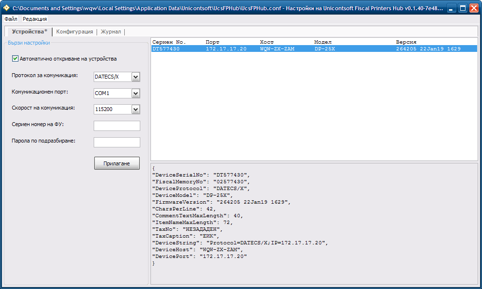

<div align="center">


## UcsFPHub
Unicontsoft Fiscal Printers Hub -- a REST service to provide remote access to locally attached fiscal devices

[](https://dev.azure.com/wqweto0976/UcsFP20/_build?definitionId=1)
[](https://github.com/wqweto/UcsFiscalPrinters/releases/download/UcsFPHub-0.1.48/UcsFPHub-0.1.48.zip)
[](https://github.com/wqweto/UcsFiscalPrinters/releases/download/UcsFPHub-latest/UcsFPHub-latest.zip)
[](https://github.com/wqweto/UcsFiscalPrinters/blob/master/LICENSE)
</div>

### Description

Unicontsoft Fiscal Printers Hub repository builds the standalone `UcsFPHub` service executable that can run as a background process or an NT service and can provide shared access to some or all of the fiscal devices that are attached to a particular client workstation.

The wire protocols implementation is provided by the parent `UcsFP20` component and supports serial COM ports connectivity to locally attached devices as well as TCP/IP (LAN) connectivity to remote ones. Most locally attached fiscal devices can be auto-detected on startup or on demand by the `UcsFPHub` service too.

You can use a settings file to allow and configure fiscal printers sharing, including the available endpoints on which `UcsFPHub` service is accessible as a JSON based REST service (local TCP/IP ports), a Service Broker queue (through Microsoft SQL Server connection) or a MySQL message queue (through as custom Poor Man's Message Queue™ implementation).



### Command-line options

`UcsFPHub.exe` service executable accepts these command-line options:

Option&nbsp;&nbsp;&nbsp;&nbsp;&nbsp; | Long&nbsp;Option&nbsp;&nbsp;&nbsp;&nbsp;&nbsp;&nbsp; | Description
------         | ---------         | ------------
`-c` `FILE`    | `--config` `FILE` | `FILE` is the full pathname to `UcsFPHub` service configuration file. If no explicit configuration options are used the service tries to find `UcsFPHub.conf` configuration file in the application folder. If still no configuration file is found the service auto-detects printers and starts a local REST service listener on `127.0.0.1:8192` by default.
`-i`           | `--install`       | Installs `UcsFPHub` as NT service. Can be used with `-c` to specify custom configuration file to be used by the NT service.
`-u`           | `--uninstall`     | Stops and removes the `UcsFPHub` NT service.
`-s`           | `--systray`       | Starts hidden with the application icon in the system notification area only.
|              | `--console`       | Starts as a console application (no GUI) with output to console.

### Configuration

The service can be configured via an optional `UcsFPHub.conf` file in JSON format. Not using a config file defaults to sharing all auto-detected devices on local COM ports and starting a REST endpoint on 127.0.0.1 port 8192/tcp that is accessible locally only.

Here is a sample settings file:

```json
{
    "Printers": {
        "AutoDetect": true,
        "PrinterID1": {
            "DeviceString": "Protocol=DATECS;Port=COM2;Speed=115200",
            "Description": "Втори етаж, счетоводството"
        }
    },
    "Endpoints": [
        {
            "Binding": "RestHttp", 
            "Address": "0.0.0.0:8192" 
        },
        { 
            "Binding": "MssqlServiceBroker", 
            "ConnectString": "Provider=SQLNCLI11;DataTypeCompatibility=80;MARS Connection=False;Data Source=SQL-PC;Initial Catalog=Dreem15_Personal;User ID=db_user;Password=%_UCS_SQL_PASSWORD%",
            "SshSettings": "Host=ssh.mycompany.com;User ID=ssh_user;Password=%_UCS_SSH_PASSWORD%",
            "QueueName": "POS-PC/12345",
            "QueueTimeout": 5000,
            "SyncDateTimeAdjustTolerance": 120
        },
        { 
            "Binding": "MysqlMessageQueue", 
            "ConnectString": "Driver={MySQL ODBC 8.0 Unicode Driver};Server=localhost;Database=MyAppDatabase;UID=root;PWD=%_UCS_MYSQL_PASSWORD%",
        },
    ],
    "Environment": {
        "_UCS_FISCAL_PRINTER_LOG": "C:\\Unicontsoft\\POS\\Logs\\UcsFP20.log",
        "_UCS_SSH_PASSWORD": "s3cr3t"
    }
}
```

`%VAR_NAME%` placeholders are expanded with values from current process environment. The `Printers` collection lists available fiscal devices while the `Endpoints` array defines where the service will be accessible from for new client connections. The `Environment` collection can be conveniently used to setup values in the service's process environment.

Currently the `UcsFPHub` service supports these endpoint bindings:

Binding                 | Description
----                    | -----------
`RestHttp`              | (Optional) Starts a REST service to listen on HTTP endpoint on local IP and TCP port. (See [`PROTOCOL.md`](PROTOCOL.md) for protocol description)
`MssqlServiceBroker`    | (Optional) Starts a Service Broker service on a Service Broker queue in a designated SQL Server database. (See [`db/combined-SQL-Server.sql`](db/combined-SQL-Server.sql) stored procedures installation script)
`MysqlMessageQueue`     | (Optional) Starts a listener on a custom message queue in a designated MySQL database. (See [`db/combined-MySQL.sql`](db/combined-MySQL.sql) tables and stored procedures installation script)
`Local`                 | Always registers a local out-of-process COM server on `UcsFPHub.LocalEndpoint` file moniker. (Accessible via `GetObject("UcsFPHub.LocalEndpoint")` in VBScript/VBA).

With this flexible configuration options it is possible to setup none, one or several `RestHttp` endpoints to listen and be accessible on different IP addresses/TCP ports. Similarly you can setup several `MssqlServiceBroker` queues in different SQL Server databases to simultaneously share all (or some) locally attached fiscal devices.

Currently the `UcsFPHub` service checks these environment variables:

Variable                          | Description
----                              | -----------
`_UCS_FISCAL_PRINTER_LOG`         | Set to `c:\path\to\UcsFP.log` to log client connections/requests and communication with fiscal devices
`_UCS_FISCAL_PRINTER_DATA_DUMP`   | Set to `1` to include data transfer dump in `_UCS_FISCAL_PRINTER_LOG`
`_UCS_FISCAL_PRINTER_FLUSH_LOG`   | Set to `1` to force flush log file to disk after each append
`_UCS_FISCAL_PRINTER_USE_XMLHTTP` | Set to `1` for PROXY protocol to use `MSXML2.XMLHTTP` instead of `MSXML2.ServerXMLHTTP` for http requests
`_UCS_SSH_PLINK`                  | Set to full pathname to `plink.exe` to spawn when setting up SSH tunnels
`_UCS_RC4_SALT`                   | Set to correct string to decrypt passwords in external .ini files
`_UCS_FP_HUB_AUTO_UPDATE`         | Set to full path and filename of an external bootstrapping executable

### Device strings

The device strings are meant to configure the connection that is used for communication with the fiscal device. Each device string is a list of entries (`Key=Value` pairs) separated by a semi-colon which is a very similar concept to a database connection string.

Here is a short list of entries supported, all of which are optional unless marked required:

Key              | Type   | Protocol | Description
----             | ----   | -------  | -----------
`Protocol`       | string |          | (Required) See [**Available protocols**](#available-protocols) below
`Port`           | string |          | Serial port the device is attached to (e.g. `COM1`)
`Speed`          | number |          | Baud rate of serial port used (e.g. `9600`)
`Persistent`     | bool   |          | Keep serial port open after operation complete (default `No`)
`IP`             | address |         | IP address on which the device is accessible in LAN (e.g. `192.168.10.200`)
`Port`           | number |          | TCP port to connect to (e.g. `4999`)
`Timeout`        | number |          | Protocol timeout for complete command execution (e.g. `15000` ms)
`ConnectionTimeout` | number |       | Connector timeout for connection attempt (e.g. `3000` ms)
`RowChars`       | number |          | Total number of characters printable on paper roll (default to auto-detected)
`CommentChars`   | number |          | Maximum number of characters available for a comment row (default to auto-detected)
`ItemChars`      | number |          | Maximum number of characters available for product name (default to auto-detected)
`MinDiscount`    | number |          | Minimum percent discount (default `-100`)
`MaxDiscount`    | number |          | Maximum percent discount (default `100`)
`MaxReceiptRows` | number |          | Max number of rows on the receipt supported
`CodePage`       | number | ESC/POS  | Code page to use when encoding strings to/from the device (e.g. `1251` or `866`)
`MaxPaymentLen`  | number | Datecs   | Max number of symbols in a payment name (default `16`)
`PingTimeout`    | number | Tremol   | Timeout for replay from fast online check (default `200` ms)
`DetailedReceipt`| bool   | Tremol   | For each PLU print quantity, price and  total on separate lines like on invoices (default `Off`)
`PrintVat`       | bool   | Tremol   | Include total VAT by tax groups in footer like on invoices (default `Off`)
`DelayPrint`     | bool   | Tremol   | Spool receipt data to device before printing (default `On`)
`BufferPrint`    | bool   | Tremol   | Buffer receipt data (default `Off`)

### Available protocols

Here is a complete list of implemented protocols with corresponding tested and supported models:

Protocol         | Manufacturer | Tested models  | Other supported models
----             | ------------ | -------------  | ----------------------
`TREMOL`         | Tremol Ltd.  | M20            | All
`DATECS`         | Datecs Ltd.  | DP-25, FP-650  | A models, B models
`DATECS/X`       | Datecs Ltd.  | DP-25X         | X models
`DAISY`          | Daisy Ltd.   | CompactM       | All
`INCOTEX`        | Incotex Ltd. | 181, 777       | All
`ELTRADE`        | Eltrade Ltd. | A3             | All
`ESC/POS`        | Tremol Ltd.  | EP-80250       | All ESC/POS "kitchen" printers
`PROXY`          | Unicontsoft  | UcsFPHub       | All

### REST service protocol description

All URLs are case-insensitive i.e. `/printers`, `/Printers` and `/PRINTERS` are the same address. Printer IDs are case-insensitive too. Each fiscal device is identified by `:printer_id` which can be either its serial number as reported by the fiscal device or an alias assigned in the service configuration.

See [`PROTOCOL.md`](PROTOCOL.md) in root on the repo for each REST service endpoint description and sample usage.
